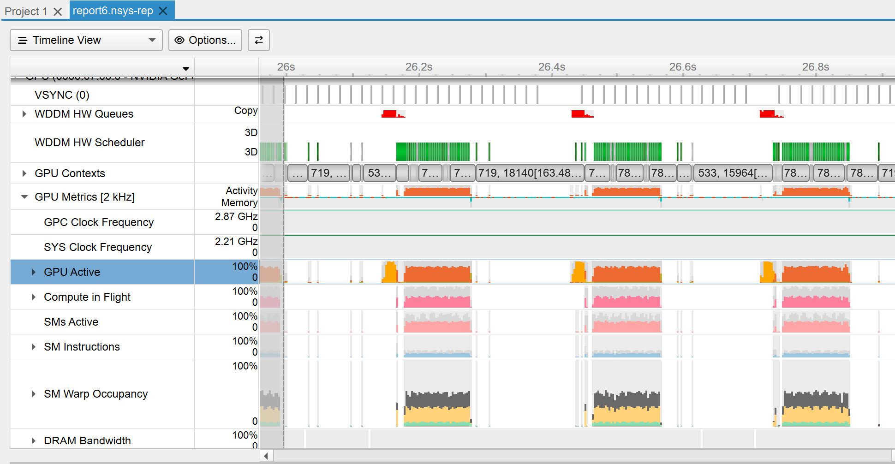
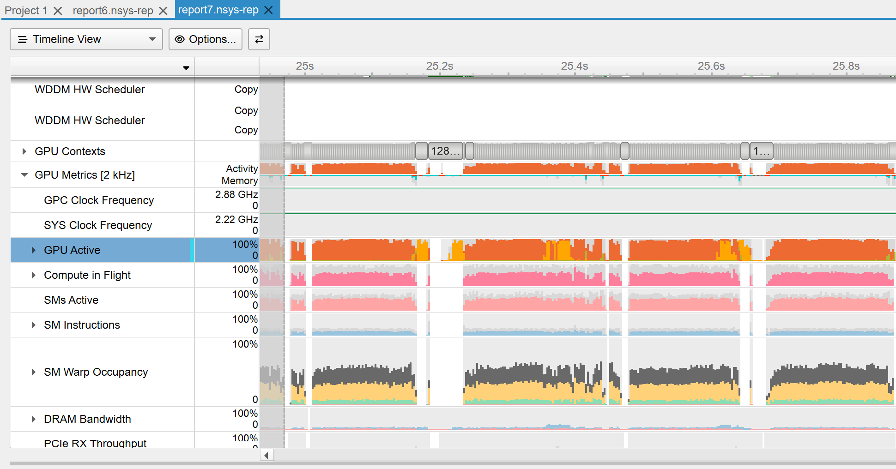

# Pseudo rendering farm for Blender

A small script to leverage parallel rendering in Blender on a single machine

> [!NOTE]
> This is not a one-size-fits-all kind of solution. It works when the render submission overhead is comparable to the cost of rendering a single frame, which is especially true for EEVEE and simpler frames. In case of Cycles, single scene or a lot of stuff to process, a regular rendering farm (like [Flamenco](https://flamenco.blender.org/)) might be a better fit.

- [Pseudo rendering farm for Blender](#pseudo-rendering-farm-for-blender)
  - [Installation](#installation)
  - [Description](#description)
  - [Results](#results)

## Installation

> [!NOTE]
> WIP to make an easier installation. Stay tuned.

The installation is straightforward. All you need to do is download latest release from the [panel on the right](https://github.com/MKlimenko/PseudoRenderingFarm/releases) and install it in Edit -> Preferences -> Add-ons -> Install from Disk... (on the top right end of the window).

## Description

To render each frame, Blender prepares the necessary data, sends it to the GPU and triggers the computations. With modern hardware and simple enough scene, the overhead of preparation might be similar or even exceeding the time it takes to produce a frame.

This plugin solves it by launching several background Blender instances in parallel. By using frame placeholders and disabling overwrite, each instance claims the frame and starts working on it independently.

The result is faster rendering due to better hardware utilization. On the left hand side you can see that the renders are separated by an amount of time equal to the render itself. At the same time, spawning multiple instances improves the situation significantly. In this scenario, we're hitting VRAM limit sooner, so I'm planning to do more testing on platforms with more memory (NVIDIA 4060 Ti 16GB or Intel Arc Pro B50/B60).

| Before                    | After                   |
|---------------------------|-------------------------|
|  |  |

## Results

With a default cube scene, as simple as it gets, we can get a minor increase of ~20% on a lower-grade machines (Mac Mini M1) and a significant improvement of up to 2x using a machine with a powerful GPU (NVIDIA 4070 Super). Below is a comparison based on 100 rendered frames.

| Device \ Instance count  | 1      | 2      | 3       | 4      |
|--------------------------|--------|--------|---------|--------|
| Mac Mini M1 (8GB)        | 119 s  | 98 s   | 100.7 s | 127 s  |
| NVIDIA 4070 Super (12GB) | 30.6 s | 25.1 s | 16.8 s  | 17.1 s |

The same principle can be also applied for an animated series. Below are the collected numbers for an episode of [Funny Legs](https://www.youtube.com/watch?v=pM53SfAU2y8&list=PLsdnreF82vL400pWANHv3mRVyBop28bTb), a 2D show made in 3D in Blender (check out the [BCon 2025 talk](https://youtu.be/FLb-ow21gB0)!). Below are the measurements to render the whole episode of 810 frames.

| Device \ Instance count  | 1       | 2       | 3       | 4       |
|--------------------------|---------|---------|---------|---------|
| Mac Mini M1 (8GB)        | 24m41s  | 18m27s  | 21m27s  | 26m21s  |
| NVIDIA 4070 Super (12GB) | 6m53s   | 4m25s   | 3m15s   | 2m52s   |
